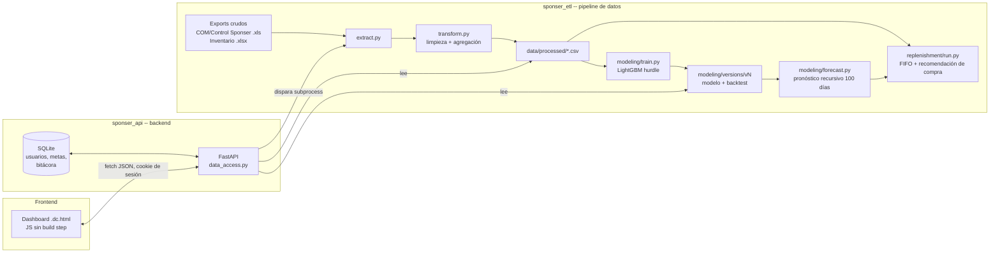

# Sponser Analítica

Sistema de analítica comercial, pronóstico de demanda y reabastecimiento
para **Sponser Costa Rica** (distribuidor de nutrición deportiva). Incluye
pipeline de datos, modelo de pronóstico y dashboard interactivo.

> **Trabajo Fin de Máster**
> - Autor: Joseph Alejandro Mora Murillo
> - Máster en Data Science, Big Data & Business Analytics 2025-2026 (semipresencial)
> - Universidad Complutense de Madrid (UCM), Instituto NTIC
> 
> Este repositorio incluye el código completo **y los datos reales** del
> cliente (autorizados para este trabajo académico) para que el pipeline, el
> modelo y el dashboard se puedan ejecutar de principio a fin sin depender de
> ningún sistema externo. Ver [Instalación y arranque](#instalación-y-arranque).

## Índice

1. [Contexto del problema](#contexto-del-problema)
2. [Arquitectura](#arquitectura)
3. [Estructura del repositorio](#estructura-del-repositorio)
4. [Stack tecnológico](#stack-tecnológico)
5. [Instalación y arranque](#instalación-y-arranque)
6. [Credenciales de acceso](#credenciales-de-acceso)
7. [El pipeline de datos](#el-pipeline-de-datos)
8. [El modelo de pronóstico de demanda](#el-modelo-de-pronóstico-de-demanda)
9. [Reabastecimiento (FIFO)](#reabastecimiento-fifo)
10. [El dashboard](#el-dashboard)
11. [Manejo de entorno y seguridad](#manejo-de-entorno-y-seguridad)
12. [Diccionario de datos](#diccionario-de-datos)
13. [Reproducir el pipeline desde cero](#reproducir-el-pipeline-desde-cero)
14. [Limitaciones conocidas y trabajo futuro](#limitaciones-conocidas-y-trabajo-futuro)
15. [Documentación adicional](#documentación-adicional)
16. [Licencia](#licencia)

## Contexto del problema

Sponser Costa Rica vende ~170 SKUs de nutrición deportiva a través de
distribuidores y tiendas. La operación enfrentaba tres problemas concretos:

- **Sin visibilidad consolidada** de ventas, clientes ni patrocinios más allá
  de reportes planos exportados a mano.
- **Reposición de inventario a criterio**, sin un pronóstico de demanda que
  distinga estacionalidad, eventos deportivos o inactividad de producto.
- **Riesgo de vencimiento**: inventario que, al ritmo de venta real, no se
  agota antes de la fecha de vencimiento del lote.

Este proyecto resuelve los tres con un pipeline de datos que limpia y agrega
las ventas/inventario reales, un modelo de pronóstico de demanda diaria por
producto, una simulación de reabastecimiento FIFO que respeta el orden de
vencimiento, y un dashboard donde el equipo comercial carga los datos,
corre el modelo y analiza los resultados.

## Arquitectura



`sponser_api` nunca importa el código de `sponser_etl` como librería: solo
lee los CSV/artefactos que produce y dispara sus scripts como subproceso
(`services/pipeline_runner.py`). Son dos proyectos independientes que viven
como carpetas hermanas bajo la misma raíz.

## Estructura del repositorio

```
sponser-analitica-tfm/
├── sponser_etl/                  # Pipeline de datos y modelado (Python + pandas + LightGBM)
│   ├── extract.py                # Lee los .xls/.xlsx crudos (data/raw/)
│   ├── transform.py               # Limpieza, conversión de moneda, tablas agregadas
│   ├── load.py                    # Escribe data/processed/*.csv
│   ├── pipeline.py                # Orquesta extract → transform → load
│   ├── modeling/
│   │   ├── features.py            # Panel producto x fecha (calendario, eventos, rezagos)
│   │   ├── train.py               # Entrena el modelo hurdle (LightGBM x2)
│   │   ├── forecast.py            # Pronóstico recursivo a 100 días
│   │   ├── backtest.py            # Precisión contra ventas reales ya ocurridas
│   │   ├── versioning.py          # Versionado de modelos (v1, v2, ... nunca sobreescribe)
│   │   └── versions/              # Modelos ya entrenados (v1-v8) + métricas + backtests
│   ├── replenishment/
│   │   ├── fifo.py                # Simulación FIFO de consumo de inventario
│   │   └── run.py                 # Orquesta la recomendación de compra
│   └── data/
│       ├── raw/                   # Exports crudos reales (.xls/.xlsx)
│       ├── processed/             # Tablas agregadas (ventas, clientes, inventario, patrocinios)
│       └── images/                # Fotos de producto (169 SKUs)
│
├── sponser_api/                  # Backend + frontend
│   ├── app/
│   │   ├── main.py                 # App FastAPI, middlewares, routers
│   │   ├── config.py               # Rutas, variables de entorno, defaults de desarrollo
│   │   ├── models_db.py            # Modelos SQLAlchemy (usuarios, metas, bitácora, pedidos)
│   │   ├── security.py             # Login, roles, reseteo de contraseña
│   │   ├── routers/                # Endpoints REST (auth, bootstrap, datos, pedido, usuarios, reportes)
│   │   └── services/
│   │       ├── data_access.py      # Capa de consultas: lee CSV, agrega, cachea
│   │       ├── pipeline_runner.py  # Dispara sponser_etl como subproceso
│   │       ├── carga_archivos.py   # Valida y guarda archivos subidos desde la web
│   │       └── email_service.py    # Envío de correo (invitaciones, reseteo de contraseña)
│   ├── frontend_src/
│   │   └── Sponser Analitica v2 Ilustrada.dc.html   # Dashboard (HTML + JS, sin build step)
│   └── requirements.txt
│
├── docs/                          # Documentación técnica ampliada (ver más abajo)
│   ├── arquitectura.md
│   ├── pipeline_datos.md
│   └── modelado.md
│
├── Dockerfile                     # Imagen del backend + sponser_etl
├── docker-compose.yml             # Backend + frontend con un solo comando
├── LICENSE.md
└── README.md
```

## Stack tecnológico

| Capa | Tecnología |
|---|---|
| Pipeline de datos | Python, pandas |
| Modelado | LightGBM (clasificación + regresión Poisson), scikit-learn |
| Backend | FastAPI, SQLAlchemy, SQLite |
| Autenticación | Sesión por cookie (correo + contraseña) |
| Frontend | HTML + JavaScript (sin framework, sin build step) |
| Correo | SMTP genérico (modo consola si no hay credenciales configuradas) |

## Instalación y arranque

Dos formas de correrlo, a elección: con Docker (un solo comando, no
requiere tener Python instalado) o con un entorno virtual manual.

### Opción A: Docker

Requisito: Docker y Docker Compose instalados.

```bash
docker compose up --build
```

Levanta el backend (con `sponser_etl` ya incluido para el pipeline) en
`http://localhost:8000` y el frontend en `http://localhost:5500`. Abrir
`http://localhost:5500/Sponser%20Analitica%20v2%20Ilustrada.dc.html`. La
base de datos persiste en un volumen con nombre entre reinicios
(`docker compose down -v` para empezar de cero). Variables de entorno como
`SPONSER_API_SECRET_KEY` se pueden fijar en la shell antes de levantar los
contenedores; ver el resto de esta sección para qué hace cada una.

> Probado con `docker compose up --build` real, login, subida de archivos
> y corrida completa del pipeline (ETL + modelo + reabastecimiento) dentro
> del contenedor.

### Opción B: entorno virtual manual

Requisitos: **Python 3.11+** (se desarrolló y probó con 3.11.9).

#### 1. Entorno virtual e instalación de dependencias

```bash
# Backend
cd sponser_api
python -m venv venv
venv\Scripts\activate          # Windows -- en Mac/Linux: source venv/bin/activate
pip install -r requirements.txt

# Pipeline de datos (puede usar el mismo entorno virtual)
cd ..\sponser_etl
pip install -r requirements.txt
```

#### 2. Arrancar el backend

```bash
cd sponser_api
python -m uvicorn app.main:app --host 127.0.0.1 --port 8000
```

Al arrancar por primera vez crea `sponser_api/data/sponser_api.db` (SQLite) y
un usuario administrador inicial (ver [Credenciales](#credenciales-de-acceso)).
El pipeline **no** hace falta correrlo manualmente para ver el dashboard con
datos: `sponser_etl/data/processed/` y `sponser_etl/modeling/versions/` ya
vienen con los datos y el modelo entrenado sobre las ventas reales de Sponser.
Si se quiere reproducir esa salida desde los archivos crudos, ver
[Reproducir el pipeline desde cero](#reproducir-el-pipeline-desde-cero).

#### 3. Arrancar el frontend

En otra terminal:

```bash
cd sponser_api/frontend_src
python -m http.server 5500
```

Abrir `http://localhost:5500/Sponser%20Analitica%20v2%20Ilustrada.dc.html`.

> **Requiere conexión a internet** la primera vez que se abre en el
> navegador: `support.js` carga React, ReactDOM y Babel desde `unpkg.com` en
> tiempo de ejecución (no vienen empaquetados en el repo). Sin internet, la
> página queda en blanco aunque el backend esté corriendo -- ver
> [Limitaciones conocidas](#limitaciones-conocidas-y-trabajo-futuro).

## Credenciales de acceso

| Correo | Contraseña | Rol |
|---|---|---|
| `m.jimenez@sponser.cr` | `sponser2026` | Administrador |

El login es de un solo paso (correo + contraseña, sin verificación
adicional). Desde la pestaña "Carga de datos", el administrador puede
invitar más usuarios con rol de administrador o de solo lectura (ver
[Manejo de entorno y seguridad](#manejo-de-entorno-y-seguridad)).

## El pipeline de datos

`sponser_etl/pipeline.py` orquesta tres pasos, cada uno un módulo
independiente y testeable por separado:

1. **`extract.py`**: los reportes de venta ("COM Sponser AAAA.xls",
   "Control Sponser AAAA.xls") no son binarios Excel, son HTML (una tabla
   `GridView` de ASP.NET exportada con extensión `.xls`). Se parsean con
   `html.parser` de la librería estándar. El inventario sí es un `.xlsx`
   genuino, leído con `pandas.read_excel`.
2. **`transform.py`**: limpieza y unificación. Conversión de colones a
   dólares, separación de patrocinios (salidas de inventario que no son
   venta) del resto de las ventas orgánicas, y construcción de las tablas
   agregadas: ventas diarias por producto, RFM de clientes, lotes de
   inventario con fecha de vencimiento.
3. **`load.py`**: escribe cada tabla a `data/processed/*.csv`.

El backend nunca corre estos scripts como librería importada: los dispara
como subproceso (`pipeline_runner.py`) desde el botón "Actualizar" del
dashboard, y registra el resultado en una bitácora auditable
(`corridas_pipeline` en la base de datos).

## El modelo de pronóstico de demanda

`sponser_etl/modeling/` implementa un modelo de demanda diaria por producto:

- **Arquitectura "hurdle"** (dos etapas, en vez de un solo regresor): dado
  que la mayoría de combinaciones producto-día no tienen venta, se entrena
  por separado (a) un **clasificador binario** LightGBM que estima la
  probabilidad de que haya venta ese día, y (b) un **regresor Poisson**
  LightGBM que estima cuánto se vende dado que sí hubo venta. La predicción
  final combina ambos: `E[demanda] = P(venta) × E[cantidad | venta]`.
- **Features** (`features.py`): calendario (día del mes, semana del año,
  trimestre, fin de semana), eventos (carreras, promociones, días hasta/desde
  el evento más cercano, `eventos.csv`), rezagos (`lag_1/2/3/7/14/28`),
  medias y desviación móvil (`rolling_mean/std` a 7/28/90 días), y el
  histórico promedio del producto.
- **Entrenamiento** (`train.py`): split temporal (los últimos 150 días como
  validación, nunca aleatorio, para no filtrar información del futuro).
  Cada corrida crea una versión nueva en `modeling/versions/vN/` sin
  sobreescribir las anteriores. Este repositorio incluye las 8 versiones
  entrenadas durante el desarrollo del modelo, con sus métricas y backtests.
- **Pronóstico** (`forecast.py`): recursivo día a día hasta 100 días hacia
  adelante. Cada predicción se encadena como insumo (rezago/rolling) del
  día siguiente, usando el modelo ya entrenado.
- **Validación** (`backtest.py`): compara el pronóstico recursivo contra
  ventas reales ya ocurridas (excluidas del entrenamiento), producto por
  producto y mes por mes. El resumen queda en
  `modeling/versions/summary.csv`; la precisión de la versión vigente se
  muestra también en el dashboard (pestaña "Carga de datos").

## Reabastecimiento (FIFO)

`sponser_etl/replenishment/fifo.py` simula el consumo del inventario
existente respetando el orden de vencimiento (lo que vence primero se
consume primero), y calcula cuánto pedir a fábrica por SKU considerando lead
time, cantidad mínima de pedido (MOQ) y múltiplo de empaque
(`sku_config.csv`). El resultado alimenta la pestaña "Pedido a fábrica" del
dashboard.

## El dashboard

`sponser_api/frontend_src/Sponser Analitica v2 Ilustrada.dc.html`: sin
build step, JavaScript plano sobre un pequeño framework de plantillas
(`support.js`). Pestañas:

- **Dashboard**: KPIs de facturación vs. meta, catálogo con tendencia de
  ventas, alerta de excedente de inventario en riesgo de vencer (inventario
  menos lo que el ritmo de venta actual va a consumir antes de esa fecha).
- **Análisis comercial**: ranking de clientes, líneas comerciales,
  concentración de ventas (Pareto 80/20), clientes inactivos, con filtro de
  año para comparar 2023-2026.
- **Proyección**: pronóstico a 3/6/12 meses por SKU, con ajuste manual y
  comparación contra el backtest del modelo.
- **Pedido a fábrica**: recomendación de compra por SKU (sugerido, cobertura,
  riesgo de quiebre de inventario, riesgo de vencimiento), edición de
  cantidad final y confirmación de pedido.
- **Patrocinios**: tendencia mensual y por cliente de las salidas de
  inventario que no son venta.
- **Carga de datos**: subir archivos de ventas/inventario actualizados,
  correr el pipeline, configurar la meta anual, gestionar pedidos en
  tránsito/patrocinios previstos, e invitar colaboradores.

## Manejo de entorno y seguridad

- **Variables de entorno** (todas con default de desarrollo, documentadas en
  `sponser_api/app/config.py`): secreto de firma de sesión, credenciales
  SMTP, credenciales del usuario administrador inicial, URLs base del
  frontend/backend. Ninguna es obligatoria para correr esto localmente.
- **Autenticación**: correo + contraseña, con bloqueo tras 5 intentos
  fallidos y reseteo de contraseña por enlace de un solo uso.
- **Roles**: `admin` (sube archivos, corre el pipeline, cambia metas/pedidos,
  invita colaboradores) y `viewer` (solo lectura de dashboards y reportes),
  aplicado tanto en la interfaz como en el backend (cada endpoint de
  escritura verifica el rol, no solo la sesión).
- **Capas de consulta**: `data_access.py` separa la lectura cacheada de CSV
  crudos (invalidada cuando cambia el archivo en disco) de los cálculos
  agregados sobre esos datos (invalidados solo cuando corre el pipeline),
  para no recalcular lo mismo en cada request.

## Diccionario de datos

Tablas principales en `sponser_etl/data/processed/`:

| Archivo | Contenido |
|---|---|
| `ventas_detalle.csv` | Una fila por línea de factura: fecha, cliente, producto, cantidad, monto (USD), moneda original |
| `ventas_diarias_producto.csv` | Ventas agregadas por producto y día (insumo directo del modelo) |
| `clientes_rfm.csv` | Recencia, frecuencia y monto por cliente |
| `inventario_lotes.csv` | Inventario por lote con fecha de vencimiento |
| `patrocinios.csv` | Salidas de inventario por patrocinio/evento (excluidas de ventas) |
| `forecast_demanda_producto.csv` | Salida del modelo: pronóstico diario a 100 días por producto |
| `recomendacion_compra.csv` | Salida del reabastecimiento FIFO: cuánto pedir por SKU |

## Reproducir el pipeline desde cero

Los datos procesados y el modelo entrenado ya están incluidos, pero para
reproducir el proceso completo desde los archivos crudos:

```bash
cd sponser_etl
python pipeline.py                 # extract + transform + load -> data/processed/*.csv
python modeling/train.py           # entrena una versión nueva del modelo (no sobreescribe las anteriores)
python modeling/backtest.py        # mide su precisión contra ventas reales ya ocurridas
python modeling/forecast.py        # pronóstico recursivo a 100 días con la versión recién entrenada
python replenishment/run.py        # recomendación de compra
```

Cada paso imprime un resumen en la terminal (filas procesadas, rango de
fechas, advertencias de archivos con formato inesperado, etc.).

Con Docker, estos mismos comandos corren dentro del contenedor del backend:

```bash
docker compose exec backend bash -c "cd ../sponser_etl && python pipeline.py"
```

## Limitaciones conocidas y trabajo futuro

- **Base de datos SQLite**: apropiada para un solo servidor/pocos usuarios
  concurrentes; un despliegue con múltiples usuarios simultáneos reales se
  beneficiaría de migrar a PostgreSQL (el proyecto ya no depende de sintaxis
  específica de SQLite salvo en la migración de columnas de desarrollo).
- **Pipeline como subproceso local**: en un despliegue en la nube (ej. Cloud
  Run), el disco no es persistente entre instancias -- los archivos subidos
  y generados necesitarían moverse a almacenamiento en la nube (Cloud
  Storage) en vez de disco local. El diseño actual está pensado para correr
  en un solo servidor (o localmente, como en este repositorio).
- **Modelo**: entrenado sobre ~3 años de historia (2023-2026); SKUs nuevos o
  con muy poca historia dependen más del histórico promedio que de patrones
  propios aprendidos.
- **Frontend con una dependencia de red**: aunque todo el backend y los datos
  son 100% locales, el dashboard carga React/ReactDOM/Babel desde `unpkg.com`
  al abrir la página (ver [Arrancar el frontend](#3-arrancar-el-frontend)).
  Una versión totalmente offline requeriría empaquetar esas librerías junto
  al repositorio en vez de cargarlas por CDN.
- **Errores de consola durante la carga inicial**: el navegador interpreta
  el HTML del archivo `.dc.html` antes de que el framework de plantillas
  (`support.js` + React, cargados desde `unpkg.com`) reemplace los
  `{{ }}` por sus valores reales, así que durante esa fracción de segundo
  aparecen advertencias de atributos SVG inválidos en la consola. Se
  verificó con pruebas automatizadas que ocurren únicamente antes de que
  la página termine de cargar (nunca durante el uso normal: login, cambio
  de pestañas, etc.) y no tienen efecto visible ni funcional. Corregirlo de
  raíz implicaría modificar `support.js`, que es el runtime del framework
  de plantillas y no código propio de este proyecto.

## Documentación adicional

Este README cubre lo necesario para instalar, correr y entender el
proyecto de punta a punta. Para el detalle técnico más profundo de cada
componente:

- [`docs/arquitectura.md`](docs/arquitectura.md): decisiones de diseño
  (por qué `sponser_api` nunca importa `sponser_etl`, las dos capas de
  caché del backend, seguridad).
- [`docs/pipeline_datos.md`](docs/pipeline_datos.md): extracción,
  transformación y carga paso a paso, incluyendo el formato real (no
  Excel) de los reportes de venta.
- [`docs/modelado.md`](docs/modelado.md): por qué una arquitectura
  "hurdle", features, metodología de validación, y una tabla comparativa
  de las 8 versiones del modelo entrenadas durante el desarrollo con sus
  métricas reales.
- [`docs/memoria/memoria.pdf`](docs/memoria/memoria.pdf): la memoria del
  TFM lista para entregar (documento formal, orientado a negocio, con el
  análisis descriptivo, la metodología de modelado y las conclusiones; 16
  páginas de contenido, dentro del límite de 20). Generada desde
  [`docs/memoria/memoria.html`](docs/memoria/memoria.html), que se puede
  volver a abrir y exportar si hace falta ajustar algo. **Pendiente de
  completar**: la sección de bibliografía debe ampliarse con las
  referencias específicas del máster.

## Licencia

Ver [`LICENSE.md`](LICENSE.md). Este repositorio incluye datos comerciales
reales de un cliente, autorizados exclusivamente para esta evaluación
académica; no es software ni datos de uso libre.
